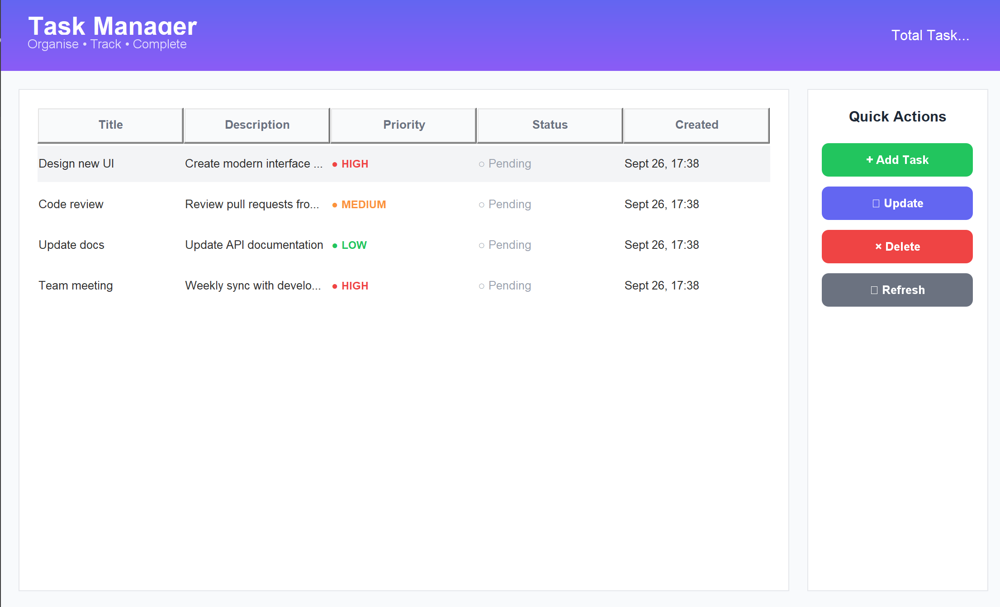

# Task Manager APP

A modern, desktop-based task management application built with Kotlin and Swing. Features a clean, intuitive interface with gradient designs, custom components, and efficient task organisation capabilities.


## Table of Contents

- [Features](#features)
- [Screenshots](#screenshots)
- [Prerequisites](#prerequisites)
- [Installation](#installation)
- [Running the Application](#running-the-application)
- [Usage Guide](#usage-guide)
- [Project Structure](#project-structure)
- [Technical Details](#technical-details)
- [Architecture](#architecture)
- [Configuration](#configuration)
- [Building from Source](#building-from-source)
- [Testing](#testing)
- [Contributing](#contributing)
- [Troubleshooting](#troubleshooting)
- [Changelog](#changelog)
- [License](#license)
- [Acknowledgments](#acknowledgments)

## Features

### Core Functionality
- **Task Creation**: Add tasks with title, description, and priority levels
- **Status Management**: Track tasks through different stages (Pending, In Progress, Completed)
- **Priority System**: Organize tasks by priority (Low, Medium, High)
- **Task Deletion**: Remove completed or unnecessary tasks
- **Real-time Updates**: Instant UI refresh when tasks are modified

### User Interface
- **Modern Design**: Clean, card-based layout with gradient header
- **Custom Components**: Rounded buttons with hover effects
- **Color Coding**: Visual indicators for priorities and statuses
- **Responsive Layout**: Optimized for desktop displays
- **Professional Typography**: Consistent font usage throughout

### Data Management
- **In-Memory Storage**: Fast access to task data
- **Unique IDs**: UUID-based identification system
- **Timestamp Tracking**: Automatic creation time recording
- **Sample Data**: Pre-loaded tasks for demonstration

## Screenshots

### Main Application Window




## Prerequisites

### Required Software
- **Java Development Kit (JDK)**: Version 11 or higher
- **Kotlin**: Version 1.9.21 or higher (handled by Gradle)
- **Gradle**: Version 8.0 or higher (wrapper included)

### System Requirements
- **Operating System**: Windows 10/11, macOS 10.14+, Linux (Ubuntu 18.04+)
- **RAM**: Minimum 2GB, Recommended 4GB
- **Disk Space**: 100MB for application and dependencies
- **Display**: Minimum 1280x720 resolution

## Installation

### Method 1: Clone from GitHub

```bash
# Clone the repository
git clone https://github.com/yourusername/task-manager.git

# Navigate to project directory
cd task-manager

# Build the project
./gradlew build      # Unix/Mac
gradlew.bat build    # Windows
```

### Method 2: Download Release

1. Go to the [Releases](https://github.com/yourusername/task-manager/releases) page
2. Download the latest `task-manager-1.0.0-all.jar`
3. Run with: `java -jar task-manager-1.0.0-all.jar`

### Method 3: IntelliJ IDEA

1. Open IntelliJ IDEA
2. Select "Get from VCS"
3. Enter repository URL
4. Click "Clone"
5. Wait for indexing to complete
6. Click the green arrow next to `main()` function

## Running the Application

### Using Gradle

```bash
# Unix/Mac
./gradlew run

# Windows
gradlew.bat run
```

### Using IntelliJ IDEA

1. Open `TaskApp.kt`
2. Click the green arrow next to `fun main()`
3. Select "Run 'TaskAppKt'"

### Using JAR File

```bash
# Build the JAR
./gradlew fatJar

# Run the JAR
java -jar build/libs/task-manager-1.0.0-all.jar
```

### Direct Kotlin Compilation

```bash
# Compile
kotlinc src/main/kotlin/TaskApp.kt -include-runtime -d TaskApp.jar

# Run
java -jar TaskApp.jar
```

## Usage Guide

### Adding a Task

1. Click the "+ Add Task" button
2. Fill in the required fields:
    - **Title**: Brief task name (required)
    - **Description**: Detailed information (required)
    - **Priority**: Select LOW, MEDIUM, or HIGH
3. Click "OK" to save

### Updating Task Status

1. Select a task from the table
2. Click "✎ Update" button
3. Choose new status:
    - PENDING: Not started
    - IN_PROGRESS: Currently working on
    - COMPLETED: Finished
4. Click "OK" to apply

### Deleting a Task

1. Select a task from the table
2. Click "× Delete" button
3. Confirm deletion in the dialog

### Refreshing the View

- Click "↻ Refresh" to reload the task list
- The view automatically updates after any operation

### Keyboard Shortcuts

| Action | Shortcut |
|--------|----------|
| Close Application | Alt+F4 (Windows), Cmd+Q (Mac) |
| Confirm Dialog | Enter |
| Cancel Dialog | Escape |

## Project Structure

```
task-manager/
├── src/
│   ├── main/
│   │   └── kotlin/
│   │       └── TaskApp.kt           # Main application file
│   └── test/
│       └── kotlin/
│           └── TaskAppTest.kt       # Test suite (optional)
├── build/
│   ├── classes/                     # Compiled classes
│   ├── libs/                        # Generated JAR files
│   └── reports/                     # Test reports
├── gradle/
│   └── wrapper/                     # Gradle wrapper files
├── .github/
│   └── workflows/
│       └── build.yml                # CI/CD configuration
├── build.gradle.kts                 # Build configuration
├── settings.gradle.kts              # Project settings
├── gradlew                          # Unix/Mac gradle wrapper
├── gradlew.bat                      # Windows gradle wrapper
├── .gitignore                       # Git ignore rules
├── LICENSE                          # MIT License
└── README.md                        # This file
```

## Technical Details

### Technology Stack

- **Language**: Kotlin 1.9.21
- **UI Framework**: Java Swing
- **Build Tool**: Gradle 8.0
- **JVM Target**: Java 11

### Key Classes

#### `SimpleTask`
Data class representing a task with properties:
- `id`: Unique identifier (UUID)
- `title`: Task name
- `description`: Detailed information
- `priority`: LOW, MEDIUM, or HIGH
- `status`: PENDING, IN_PROGRESS, or COMPLETED
- `createdAt`: Timestamp of creation

#### `SimpleManager`
Manages task operations:
- `createTask()`: Adds new task
- `updateStatus()`: Modifies task status
- `deleteTask()`: Removes task
- `getAllTasks()`: Returns all tasks
- `getTaskCount()`: Returns total count

#### `TaskApp`
Main UI class extending JFrame:
- Creates and manages UI components
- Handles user interactions
- Updates display based on data changes

#### `ModernButton`
Custom button component with:
- Rounded corners
- Hover effects
- Custom painting
- Color themes

#### `GradientPanel`
Panel with gradient background for header section

## Architecture

### Design Patterns

1. **MVC Pattern**
    - Model: `SimpleTask`, `SimpleManager`
    - View: UI components in `TaskApp`
    - Controller: Event handlers in `TaskApp`

2. **Observer Pattern**
    - Table updates when data changes
    - Statistics refresh on modifications

3. **Factory Pattern**
    - Task creation with UUID generation

### Data Flow

```
User Input → Event Handler → Manager → Data Update → UI Refresh
```

## Configuration

### Build Configuration (build.gradle.kts)

```kotlin
plugins {
    kotlin("jvm") version "1.9.21"
    application
}

group = "com.taskmanager"
version = "1.0.0"

repositories {
    mavenCentral()
}

dependencies {
    implementation(kotlin("stdlib"))
}

kotlin {
    jvmToolchain(11)
}

application {
    mainClass.set("TaskAppKt")
}
```

### Customization Options

#### Colors
Modify color values in `TaskApp` class:
```kotlin
private val primaryColor = Color(99, 102, 241)
private val successColor = Color(34, 197, 94)
private val dangerColor = Color(239, 68, 68)
```

#### Window Size
Adjust in the `init` block:
```kotlin
setSize(1100, 650)  // Width, Height
```

#### Font
Change font family and sizes:
```kotlin
font = Font("Arial", Font.BOLD, 28)
```

## Building from Source

### Development Build

```bash
./gradlew clean build
```

### Production Build

```bash
./gradlew clean fatJar
```

### Distribution Package

```bash
./gradlew clean fatJar
cp build/libs/task-manager-*-all.jar dist/
```

## Testing

### Running Tests

```bash
./gradlew test
```

### Test Coverage

```bash
./gradlew test jacocoTestReport
```

### Manual Testing Checklist

- [ ] Add task with all fields
- [ ] Add task with empty fields (should show error)
- [ ] Update status for each state
- [ ] Delete task with confirmation
- [ ] Delete task and cancel
- [ ] Select task and perform actions
- [ ] Refresh view
- [ ] Close application

## Contributing

### Getting Started

1. Fork the repository
2. Create a feature branch (`git checkout -b feature/AmazingFeature`)
3. Commit changes (`git commit -m 'Add AmazingFeature'`)
4. Push to branch (`git push origin feature/AmazingFeature`)
5. Open a Pull Request

### Code Style

- Use Kotlin coding conventions
- Maintain consistent indentation (4 spaces)
- Add comments for complex logic
- Keep functions under 50 lines
- Use meaningful variable names

### Commit Messages

Follow conventional commits:
- `feat:` New feature
- `fix:` Bug fix
- `docs:` Documentation
- `style:` Formatting
- `refactor:` Code restructuring
- `test:` Testing
- `chore:` Maintenance

## Troubleshooting

### Common Issues

#### Application Won't Start
- **Solution**: Check Java version with `java -version`
- Ensure Java 11+ is installed

#### Gradle Build Fails
- **Solution**: Clear cache with `./gradlew clean`
- Delete `.gradle` folder and rebuild

#### UI Components Not Visible
- **Solution**: Check display scaling settings
- Try different Look and Feel

#### Memory Issues
- **Solution**: Increase heap size
```bash
java -Xmx512m -jar task-manager.jar
```

### Error Messages

| Error | Solution |
|-------|----------|
| `ClassNotFoundException` | Rebuild project |
| `NoSuchMethodError` | Check Kotlin version |
| `OutOfMemoryError` | Increase heap size |
| `UnsupportedClassVersionError` | Update Java version |

## Changelog

### Version 1.0.0 (2025-01-01)
- Initial release
- Core task management features
- Modern UI with gradient design
- Custom button components
- Color-coded priorities and statuses

### Planned Features
- Data persistence (SQLite/JSON)
- Task categories/tags
- Due date functionality
- Search and filter
- Export to CSV/PDF
- Dark mode
- Keyboard shortcuts
- Multi-language support

## License

This project is licensed under the MIT License - see the [LICENSE](LICENSE) file for details.

```
MIT License

Copyright (c) 2025 Task Manager Pro

Permission is hereby granted, free of charge, to any person obtaining a copy
of this software and associated documentation files (the "Software"), to deal
in the Software without restriction, including without limitation the rights
to use, copy, modify, merge, publish, distribute, sublicense, and/or sell
copies of the Software, and to permit persons to whom the Software is
furnished to do so, subject to the following conditions:

The above copyright notice and this permission notice shall be included in all
copies or substantial portions of the Software.

THE SOFTWARE IS PROVIDED "AS IS", WITHOUT WARRANTY OF ANY KIND, EXPRESS OR
IMPLIED, INCLUDING BUT NOT LIMITED TO THE WARRANTIES OF MERCHANTABILITY,
FITNESS FOR A PARTICULAR PURPOSE AND NONINFRINGEMENT.
```

## Acknowledgments

- Kotlin team for the excellent language
- JetBrains for IntelliJ IDEA
- OpenJDK community
- Gradle team for the build system
- Contributors and testers

## Contact

- **Author**: Neha Thottathil
- **Email**: nthottathil@live.co.uk
- **GitHub**: [@nthottathil](https://github.com/nthottathil)
- **LinkedIn**: [Neha Thottathil](https://www.linkedin.com/in/neha-thottathil-8a41331b4/)

---

**Made with Kotlin** | **Built for Productivity**
